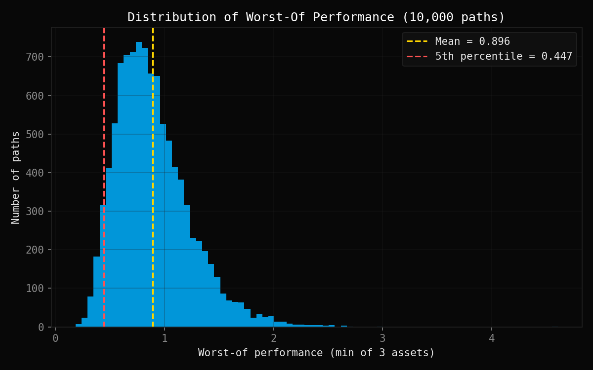
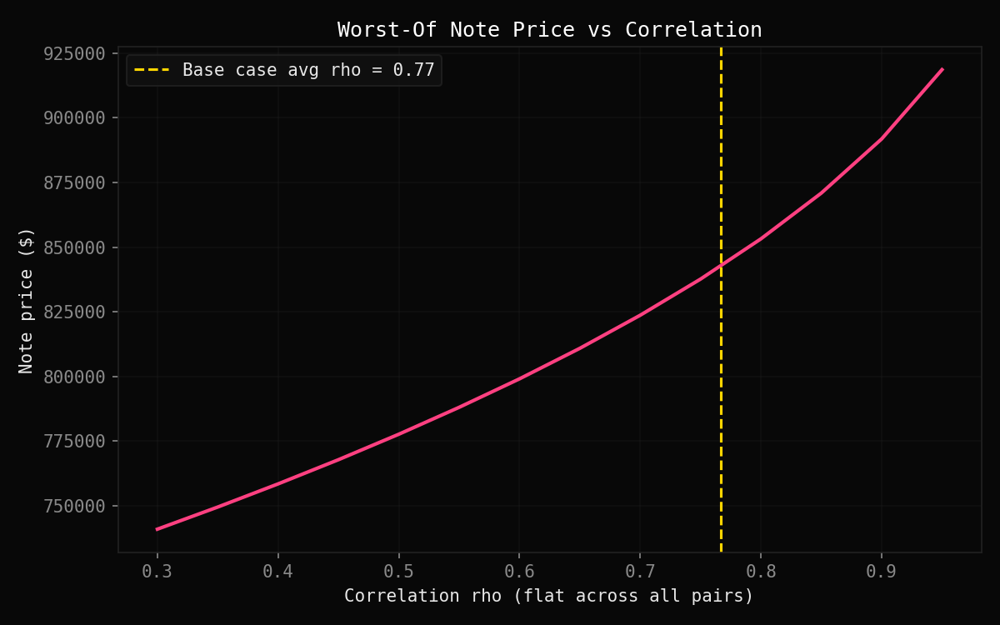
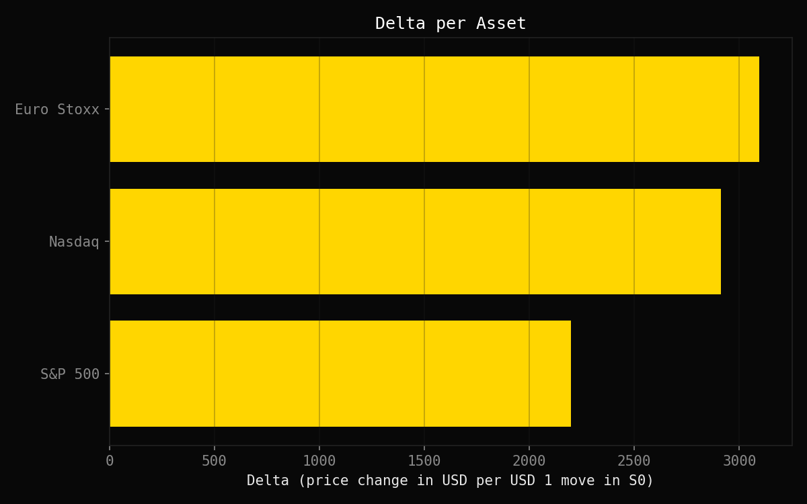

# Worst-Of Basket Note Pricing


A self-contained Python project pricing a **worst-of basket note** on
three correlated equity indices (S&P 500, Nasdaq, Euro Stoxx) via Monte
Carlo simulation, with per-asset Delta and a correlation sensitivity
study.

## Product description

A **worst-of basket note** is a structured product written on several
underlyings (here three equity indices). At maturity, the investor's
payoff is driven by whichever asset in the basket performed **worst** —
not the average, not any single pre-chosen asset. This makes the note
implicitly short the **correlation** and the **dispersion** between the
basket's components: the less correlated the assets, the more likely at
least one of them lags badly, and the lower the worst-of payoff (and
price) becomes.

## Methodology

### 1. Correlation structure (`correlation.py`)

The three assets' co-movements are described by a 3x3 correlation
matrix. Since a valid correlation matrix must be symmetric and positive
definite (no real-world joint distribution exists otherwise), it is
checked via its eigenvalues, then decomposed with the **Cholesky
factorization**:

```
corr_matrix = L @ L.T
```

`L` lets us turn independent random draws into correlated ones (see
below) — this is the standard bridge between "easy to simulate"
(independent noise) and "what we need" (correlated asset returns).

### 2. Monte Carlo simulation (`simulation.py`)

Each asset's terminal value follows risk-neutral **Geometric Brownian
Motion**:

```
Si(T) = Si(0) * exp((r - sigma_i^2 / 2) * T + sigma_i * sqrt(T) * Wi)
```

Independent noise `Z ~ N(0, I)` is correlated via `W = Z @ L.T`, so that
`Cov(W) = L @ L.T = corr_matrix`. Since the worst-of payoff only depends
on terminal values (a European-style payoff, no path dependency), we
simulate `Si(T)` directly via the closed-form GBM solution — no
time-stepping needed, and no discretization error.

### 3. Worst-of pricing (`pricing.py`)

```
Price = notional * e^(-rT) * E[min(S1(T)/S1(0), S2(T)/S2(0), S3(T)/S3(0))]
```

The `e^(-rT)` factor is exactly a zero-coupon bond price at maturity T —
the same discounting object used throughout derivatives pricing. There
is no closed-form formula for the minimum of several correlated
lognormal variables, so Monte Carlo is necessary. The estimate comes
with a **95% confidence interval**:

```
price +/- 1.96 * notional * e^(-rT) * std(payoffs) / sqrt(N)
```

### 4. Sensitivities (`sensitivities.py`)

- **Delta per asset**: bump each `Si(0)` by +1% in turn (others held
  fixed), re-simulate with the **same random seed** (common random
  numbers — isolates the bump's effect from Monte Carlo noise), reprice,
  and difference. A worst-of note has three separate deltas, one per
  underlying, since each asset can independently become "the worst
  performer" driving the payoff.
- **Price vs rho**: the price *increases* with correlation. High
  correlation means the three assets move together, so the worst
  performer stays close to the typical performance. Low correlation
  means more dispersion, so the minimum tends to be pulled down further
  — a worst-of note is structurally **short correlation**.

## Key results

Computed with the parameters in [Parameters](#parameters), seed 42:

| Metric | Value |
|---|---|
| Note price | **$843,443** |
| 95% CI | **[$837,146, $849,740]** |
| Delta S&P 500 | **2,196.72** |
| Delta Nasdaq | **2,913.19** |
| Delta Euro Stoxx | **3,095.58** |

*(Run `python main.py` to reproduce — `np.random.seed(42)` makes every
run deterministic.)*

Euro Stoxx carries the largest delta despite a mid-range volatility
(22%, between S&P's 20% and Nasdaq's 25%): it has the **lowest**
correlations to the other two assets (0.75 and 0.70 vs. 0.85 for
S&P-Nasdaq), so it ends up being the worst performer — and therefore the
payoff driver — more often.

## Parameters

| Asset | S0 | Volatility |
|---|---|---|
| S&P 500 | 100 | 20% |
| Nasdaq | 100 | 25% |
| Euro Stoxx | 100 | 22% |

| Correlation pair | Value |
|---|---|
| rho(S&P, Nasdaq) | 0.85 |
| rho(S&P, EuroStoxx) | 0.75 |
| rho(Nasdaq, EuroStoxx) | 0.70 |

| Note parameter | Value |
|---|---|
| Notional | $1,000,000 |
| Maturity | 3 years |
| Risk-free rate | 2% |
| Monte Carlo paths | 10,000 |

## Running

```bash
pip install numpy matplotlib
python main.py
```

Expected runtime: well under 10 seconds for 10,000 paths.

Prints:

```
Note price:      $843,443
95% CI:          [$837,146, $849,740]
Delta S&P:       2196.72
Delta Nasdaq:    2913.19
Delta EuroStoxx: 3095.58
```

and saves three plots to `Graphiques/`:
1. Histogram of worst-of performances across 10,000 paths (mean + 5th percentile marked).
2. Note price vs correlation rho (base case marked with a dashed line).
3. Delta per asset (horizontal bar chart).

## Project structure

```
worst_of_basket/
├── correlation.py      # correlation matrix, positive-definite check, Cholesky
├── simulation.py        # correlated GBM terminal value simulation
├── pricing.py           # worst-of payoff, Monte Carlo price, 95% CI
├── sensitivities.py      # per-asset Delta, price vs correlation
├── style.py              # "Quant Dark" matplotlib theme
├── main.py               # orchestration, printed summary, plots
└── README.md
```

Every theory point (correlation matrices, Cholesky, GBM, risk-neutral
pricing, worst-of payoffs, Monte Carlo confidence intervals, multi-asset
Delta, correlation sensitivity) is documented as a `# TODO: THEORY`
comment block directly above the relevant code.

## Gallery

| Worst-of performance distribution | Price vs correlation |
|:---:|:---:|
|  |  |

| Delta per asset |
|:---:|
|  |
